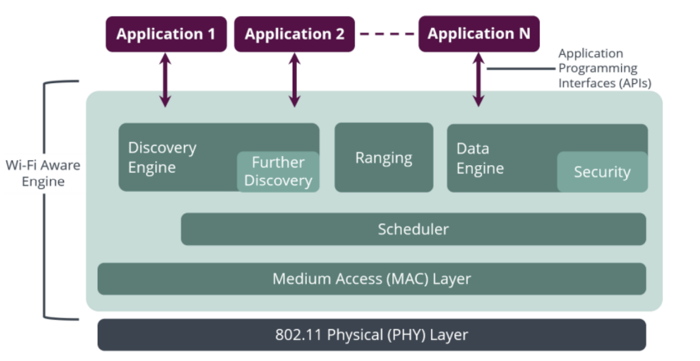

# AOSP Data Service & Handover

<figure><figcaption></figcaption></figure>

## AOSP DataNetwork code

```
/**
 * DataNetwork class represents a single PDN (Packet Data Network).
 *
 * The life cycle of a data network starts from {@link ConnectingState}. If setup data request
 * succeeds, then it enters {@link ConnectedState}, otherwise it enters
 * {@link DisconnectedState}.
 *
 * When data network is in {@link ConnectingState}, it can enter {@link HandoverState} if handover
 * between IWLAN and cellular occurs. After handover completes or fails, it return back to
 * {@link ConnectedState}. When the data network is about to be disconnected, it first enters
 * {@link DisconnectingState} when performing graceful tear down or when sending the data
 * deactivation request. At the end, it enters {@link DisconnectedState} when {@link DataService}
 * notifies data disconnected. Note that an unsolicited disconnected event from {@link DataService}
 * or any vendor HAL failure response can immediately move data network from {@link ConnectedState}
 * to {@link DisconnectedState}. {@link DisconnectedState} is the final state of a data network.
 *
 * State machine diagram:
 *
 *
 *                                  ┌─────────┐
 *                                  │Handover │
 *                                  └─▲────┬──┘
 *                                    │    │
 *             ┌───────────┐        ┌─┴────▼──┐        ┌──────────────┐
 *             │Connecting ├────────►Connected├────────►Disconnecting │
 *             └─────┬─────┘        └────┬────┘        └───────┬──────┘
 *                   │                   │                     │
 *                   │             ┌─────▼──────┐              │
 *                   └─────────────►Disconnected◄──────────────┘
 *                                 └────────────┘
 *
 */
```

##

## AP assited IWLAN handover & legacy handover

The main difference between AP-assisted IWLAN (Internet Wireless Local Area Network) handover and legacy IWLAN handover lies in the involvement of the access point (AP) in the handover process. Here's a brief explanation of each:

1. Legacy IWLAN Handover: In legacy IWLAN handover, the handover process is primarily handled by the mobile device and the cellular network infrastructure. The mobile device detects the presence of a Wi-Fi network and initiates the handover process based on the signal strength and other criteria. The handover decision and execution are performed within the device, typically involving the modem and the Wi-Fi subsystem. The cellular network infrastructure is responsible for managing the handover from the cellular network to the Wi-Fi network.
2. AP-Assisted IWLAN Handover: AP-assisted IWLAN handover, QNS will call back to AP FW callback. The framework then triggers a handover through RIL.


## Special check for AP-Assisted IWLAN&#x20;

```
evaluateDataNetworkHandover() will Evaluate if it is allowed to handover the data network between IWLAN and cellular. Some
carriers do not allow handover in certain conditions.
```

### config\_enhanced\_iwlan\_handover\_check

isEnhancedIwlanHandoverCheckEnabled()

If enabled, telephony frameworks will not perform handover if the target transport is out of service, or VoPS not supported. The network will be torn down on the source transport, and will be re-established on the target transport when condition is allowed for bringing up a new network.

### iwlan\_handover\_policy\_string\_array

```
    /**
     * IWLAN handover rules that determine whether handover is allowed or disallowed between
     * cellular and IWLAN.
     *
     * Rule syntax: "source=[GERAN|UTRAN|EUTRAN|NGRAN|IWLAN|UNKNOWN], target=[GERAN|UTRAN|EUTRAN
     * |NGRAN|IWLAN], type=[allowed|disallowed], roaming=[true|false], capabilities=[INTERNET|MMS
     * |FOTA|IMS|CBS|SUPL|EIMS|XCAP|DUN]"
     *
     * Note that UNKNOWN can be only specified in the source access network and can be only used
     * in the disallowed rule.
     *
     * The handover rules will be matched in the order. Here are some sample rules.
     * <string-array name="iwlan_handover_rules" num="5">
     *     <!-- Handover from IWLAN to 2G/3G is not allowed -->
     *     <item value="source=IWLAN, target=GERAN|UTRAN, type=disallowed"/>
     *     <!-- Handover from 2G/3G to IWLAN is not allowed -->
     *     <item value="source=GERAN|UTRAN, target:IWLAN, type=disallowed"/>
     *     <!-- Handover from IWLAN to 3G/4G/5G is not allowed if the device is roaming. -->
     *     <item value="source=IWLAN, target=UTRAN|EUTRAN|NGRAN, roaming=true, type=disallowed"/>
     *     <!-- Handover from 4G to IWLAN is not allowed if the device has capability in either IMS
     *     or EIMS-->
     *     <item value="source=EUTRAN, target=IWLAN, type=disallowed, capabilities=IMS|EIMS"/>
     *     <!-- Handover is always allowed in any condition. -->
     *     <item value="source=GERAN|UTRAN|EUTRAN|NGRAN|IWLAN,
     *         target=GERAN|UTRAN|EUTRAN|NGRAN|IWLAN, type=allowed"/>
     * </string-array>
     *
     * When handover is not allowed, frameworks will tear down the data network on source transport,
     * and then setup a new one on the target transport when Qualified Network Service changes the
     * preferred access networks for particular APN types.
     *
     * @hide
     */
    public static final String KEY_IWLAN_HANDOVER_POLICY_STRING_ARRAY =
            "iwlan_handover_policy_string_array";
```
