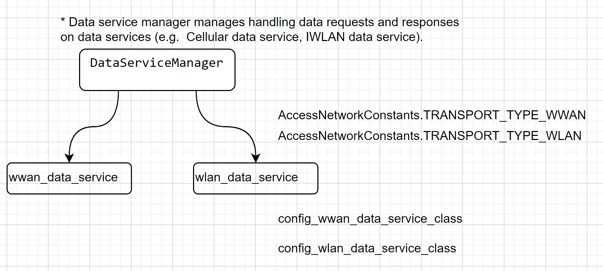

# An Example to use NAN

<figure><figcaption>
From <a href="https://aaltodoc.aalto.fi/server/api/core/bitstreams/4a521391-e53a-4d8f-b49a-d776d0467a0a/content">https://aaltodoc.aalto.fi/server/api/core/bitstreams/4a521391-e53a-4d8f-b49a-d776d0467a0a/content</a>
</figcaption></figure>

In the context of Wi-Fi Aware, a "Service Name Match Filter" specifically refers to the use of service names as criteria for filtering during service discovery.
